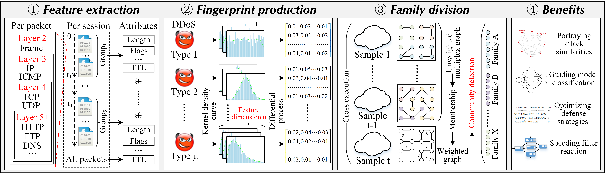
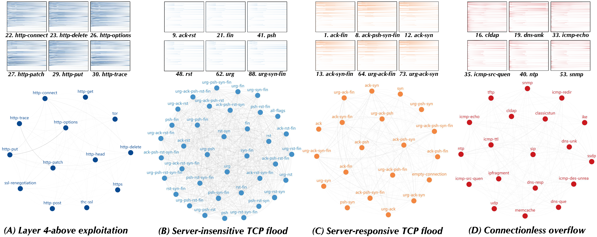

### Struggling under Massive Types of DDoS? Try Dividing Them into Attack Families



## Introduction

Distributed Denial of Service (DDoS) defense is a profound research problem. In recent years, adversaries tend to complicate their attack strategies by crafting vast DDoS variants. On the one hand, this trend exacerbates both extremes of classification granularity (i.e., binary and attack level) in existing machine learning methods. On the other hand, massive attack categories make the filter rule table bulky, as well as cause problems of slow reaction presented in the recent state-of-the-art DDoS mitigation system. 
To this end, we propose **the concept of a DDoS family** to reconcile these issues. The specific technical roadmap includes *traffic pattern characterization*, *attack fingerprint production*, and *cross-executed family partition by community detection*. 
This anonymous repository stores part of code, dataset, feature set, and so on. 

## Dataset

The used DDoS traffic datasets and the extracted feature files are stored in ./dataset.

## Requirements

```bash
pip install scipy
pip install numpy
pip install pandas
pip install tqdm
pip install leidenalg
pip install joblib
pip install pickle
pip install sklearn
```

## Feature Extraction

The feature extraction program is stored in ./code/preprocess.py and protocol_mapping.py. 
Please configure the data input path that includes PCAP traffic split by 5-tuple. 

```bash
python preprocess.py
```

## Code 

The main function is stored in ./code/main.py.
```bash
python main.py
```

## Families

The four attack families constructed based on the 89 DDoS species are shown below.



<table>
	<col style = "width: 15%" />
	<col style = "width: 3%" />
	<col style = "width: 17%" />
	<col style = "width: 65%" />
	<thread>
		<tr>
			<th bgcolor="#000000"><Font color="white">Family</Font></th>
			<th bgcolor="#000000"><Font color="white">Index</Font></th>
			<th bgcolor="#000000"><Font color="white">DDoS</Font></th>
			<th bgcolor="#000000"><Font color="white">Description</Font></th>
		</tr>
	</thread>
	<tbody>
		<tr>
			<th rowspan="13" bgcolor="#FFFFFF">Layer-4 above exploitation</th>
			<th bgcolor="#FFFFFF">22</th>
			<th bgcolor="#FFFFFF">http-connect</th>
			<th bgcolor="#FFFFFF"><a href="https://kb.mazebolt.com/knowledgebase/http-connect-flood/">HTTP CONNECT floods are designed to overwhelm web servers’ resources by continuously requesting single or multiple URL’s from many source attacking machines, which simulate a HTTP clients, such as web browsers (Though the attack analyzed here, does not use browser emulation). An HTTP CONNECT Flood consists of CONNECT requests. Unlike other HTTP floods that may include other request methods such as POST, PUT, DELETE, etc.</a></th>
		</tr>
		<tr>
			<th bgcolor="#AFEEEE">23</th>
			<th bgcolor="#AFEEEE">http-delete</th>
			<th bgcolor="#AFEEEE"><a href="https://kb.mazebolt.com/knowledgebase/http-delete-flood/">An HTTP DELETE Flood consists of DELETE requests. Unlike other HTTP floods that may include other request methods such as POST, PUT, GET, etc.</a></th>
		</tr>
		<tr>
			<th bgcolor="#FFFFFF">24</th>
			<th bgcolor="#FFFFFF">http-get</th>
			<th bgcolor="#FFFFFF"><a href="https://kb.mazebolt.com/knowledgebase/http-get-flood/">An HTTP GET Flood consist of GET requests. Unlike other HTTP floods that may include other request methods such as POST, PUT, DELETE etc.</a></th>
		</tr>
		<tr>
			<th bgcolor="#AFEEEE">25</th>
			<th bgcolor="#AFEEEE">http-head</th>
			<th bgcolor="#AFEEEE"><a href="https://kb.mazebolt.com/knowledgebase/http-head-flood/">An HTTP HEAD Flood consists of HEAD requests. Unlike other HTTP floods that may include other request methods such as POST, PUT, DELETE, etc.</a></th>
		</tr>
		<tr>
			<th bgcolor="#FFFFFF">26</th>
			<th bgcolor="#FFFFFF">http-options</th>
			<th bgcolor="#FFFFFF"><a href="https://kb.mazebolt.com/knowledgebase/http-options-flood/">An HTTP OPTIONS Flood consists of OPTIONS requests. Unlike other HTTP floods that may include other request methods such as POST, PUT, GET, etc.</a></th>
		</tr>
		<tr>
			<th bgcolor="#AFEEEE">27</th>
			<th bgcolor="#AFEEEE">http-patch</th>
			<th bgcolor="#AFEEEE"><a href="https://kb.mazebolt.com/knowledgebase/http-patch-flood/">An HTTP PATCH Flood consists of PATCH requests. Unlike other HTTP floods that may include other request methods such as POST, PUT, GET, etc.</a></th>
		</tr>
		<tr>
			<th bgcolor="#FFFFFF">28</th>
			<th bgcolor="#FFFFFF">http-post</th>
			<th bgcolor="#FFFFFF"><a href="https://kb.mazebolt.com/knowledgebase/http-post-flood/">An HTTP POST Flood consist of POST requests. Unlike other HTTP floods that may include other request methods such as GET, PUT, DELETE etc.</a></th>
		</tr>
		<tr>
			<th bgcolor="#AFEEEE">29</th>
			<th bgcolor="#AFEEEE">http-put</th>
			<th bgcolor="#AFEEEE"><a href="https://kb.mazebolt.com/knowledgebase/http-put-flood/">An HTTP PUT Flood consists of PUT requests. Unlike other HTTP floods that may include other request methods such as POST, DELETE, GET, etc.</a></th>
		</tr>
		<tr>
			<th bgcolor="#FFFFFF">30</th>
			<th bgcolor="#FFFFFF">http-trace</th>
			<th bgcolor="#FFFFFF"><a href="https://kb.mazebolt.com/knowledgebase/http-trace-flood/">An HTTP TRACE Flood consists of TRACE requests. Unlike other HTTP floods that may include other request methods such as POST, PUT, GET, etc.</a></th>
		</tr>
		<tr>
			<th bgcolor="#AFEEEE">31</th>
			<th bgcolor="#AFEEEE">https</th>
			<th bgcolor="#AFEEEE"><a href="https://kb.mazebolt.com/knowledgebase/https-flood/">Similar to an and HTTP flood, HTTPS floods are a DDoS attack designed to overwhelm web servers’ resources by continuously requesting single or multiple URL’s from many source attacking machines.</a></th>
		</tr>
		<tr>
			<th bgcolor="#FFFFFF">55</th>
			<th bgcolor="#FFFFFF">ssl-renegotiation</th>
			<th bgcolor="#FFFFFF"><a href="https://kb.mazebolt.com/knowledgebase/ssl-negotiation-flood/">SSL Renegotiation attack is a DDoS attack which attempts to establish many news SSL handshakes with the targeted server.</a></th>
		</tr>
		<tr>
			<th bgcolor="#AFEEEE">59</th>
			<th bgcolor="#AFEEEE">thc-ssl</th>
			<th bgcolor="#AFEEEE"><a href="https://kb.mazebolt.com/knowledgebase/thc-ssl-flood/">This attack uses a single TCP connection to continuously renegotiate new encryption keys.</a></th>
		</tr>
		<tr>
			<th bgcolor="#FFFFFF">60</th>
			<th bgcolor="#FFFFFF">tor</th>
			<th bgcolor="#FFFFFF"><a href="https://kb.mazebolt.com/knowledgebase/tors-hammer-attack/">Tor’s Hammer is a ‘low and slow’ HTTP Post DDoS attack vector. It can also be run through the Tor network to be anonymized.  The idea with Tor’s Hammer attack is to saturate the entire TCP stack for the HTTP/S daemon; this is done by slowly opening up connections and then sending an incomplete request in attempt to keep the connection alive as long as possible. The tool does this slowly and it is possible in some cases that a single attacking machine can take down a web server.</a></th>
		</tr>
		<tr>
			<th rowspan="37" bgcolor="#FFFFFF">Server-insensitive TCP flood </th>
			<th bgcolor="#AFEEEE">4</th>
			<th bgcolor="#AFEEEE">ack-psh-rst-fin</th>
			<th bgcolor="#AFEEEE"><a href="https://kb.mazebolt.com/knowledgebase/ack-psh-rst-fin-flood/">An ACK-PSH-RST-FIN flood is a DDoS attack designed to disrupt network activity by saturating bandwidth and resources on stateful devices in its path.</a></th>
		</tr>
		<tr>
			<th bgcolor="#FFFFFF">5</th>
			<th bgcolor="#FFFFFF">ack-psh-rst-syn</th>
			<th bgcolor="#FFFFFF"><a href="https://kb.mazebolt.com/knowledgebase/ack-psh-rst-syn-flood/">An ACK-PSH-RST-SYN flood is a DDoS attack designed to disrupt network activity by saturating bandwidth and resources on stateful devices in its path.</a></th>
		</tr>
		<tr>
			<th bgcolor="#AFEEEE">6</th>
			<th bgcolor="#AFEEEE">ack-psh-rst-syn-fin</th>
			<th bgcolor="#AFEEEE"><a href="https://kb.mazebolt.com/knowledgebase/ack-psh-rst-syn-fin-flood/">An ACK-PSH-RST-SYN-FIN flood is a DDoS attack designed to disrupt network activity by saturating bandwidth and resources on stateful devices in its path.</a></th>
		</tr>
		<tr>
			<th bgcolor="#FFFFFF">9</th>
			<th bgcolor="#FFFFFF">ack-rst</th>
			<th bgcolor="#FFFFFF"><a href="https://kb.mazebolt.com/knowledgebase/ack-rst-flood/">An ACK-RST flood is a DDoS attack designed to disrupt network activity by saturating bandwidth and resources on stateful devices in its path.</a></th>
		</tr>
		<tr>
			<th bgcolor="#AFEEEE">10</th>
			<th bgcolor="#AFEEEE">ack-rst-fin</th>
			<th bgcolor="#AFEEEE"><a href="https://kb.mazebolt.com/knowledgebase/ack-rst-fin-flood/">An ACK-RST-FIN flood is a DDoS attack designed to disrupt network activity by saturating bandwidth and resources on stateful devices in its path.</a></th>
		</tr>
		<tr>
			<th bgcolor="#FFFFFF">11</th>
			<th bgcolor="#FFFFFF">ack-rst-syn-fin</th>
			<th bgcolor="#FFFFFF"><a href="https://kb.mazebolt.com/knowledgebase/ack-rst-syn-fin-flood/">An ACK-RST-SYN-FIN flood is a DDoS attack designed to disrupt network activity by saturating bandwidth and resources on stateful devices in its path.</a></th>
		</tr>
		<tr>
			<th bgcolor="#AFEEEE">14</th>
			<th bgcolor="#AFEEEE">all-flags</th>
			<th bgcolor="#AFEEEE"><a href="https://kb.mazebolt.com/knowledgebase/all-tcp-flags-flood-xmas-flood/">An ALL TCP FLAGS flood is a DDoS attack designed to disrupt network activity by saturating bandwidth and resources on stateful devices in its path.</a></th>
		</tr>
		<tr>
			<th bgcolor="#FFFFFF">21</th>
			<th bgcolor="#FFFFFF">fin</th>
			<th bgcolor="#FFFFFF"><a href="https://kb.mazebolt.com/knowledgebase/fin-flood/">FIN Flood is a DDoS attack aimed at consuming computing power and saturating bandwidth. FIN Floods are generally spoofed attacks and normally come at a very high rate.</a></th>
		</tr>
		<tr>
			<th bgcolor="#AFEEEE">41</th>
			<th bgcolor="#AFEEEE">psh</th>
			<th bgcolor="#AFEEEE"><a href="https://kb.mazebolt.com/knowledgebase/psh-flood/">An PSH flood is a DDoS attack designed to disrupt network activity by saturating bandwidth and resources on stateful devices in its path.</a></th>
		</tr>
		<tr>
			<th bgcolor="#FFFFFF">42</th>
			<th bgcolor="#FFFFFF">psh-fin</th>
			<th bgcolor="#FFFFFF"><a href="https://kb.mazebolt.com/knowledgebase/psh-fin-flood/">A PSH-FIN flood is a DDoS attack designed to disrupt network activity by saturating bandwidth and resources on stateful devices in its path.</a></th>
		</tr>
		<tr>
			<th bgcolor="#AFEEEE">43</th>
			<th bgcolor="#AFEEEE">psh-rst-fin</th>
			<th bgcolor="#AFEEEE"><a href="https://kb.mazebolt.com/knowledgebase/psh-rst-fin-flood/">An PSH-RST-FIN flood is a DDoS attack designed to disrupt network activity by saturating bandwidth and resources on stateful devices in its path.</a></th>
		</tr>
		<tr>
			<th bgcolor="#FFFFFF">44</th>
			<th bgcolor="#FFFFFF">psh-rst-syn</th>
			<th bgcolor="#FFFFFF"><a href="https://kb.mazebolt.com/knowledgebase/psh-rst-syn-flood/">A PSH-RST-SYN flood is a DDoS attack designed to disrupt network activity by saturating bandwidth and resources on stateful devices in its path.</a></th>
		</tr>
		<tr>
			<th bgcolor="#AFEEEE">45</th>
			<th bgcolor="#AFEEEE">psh-rst-syn-fin</th>
			<th bgcolor="#AFEEEE"><a href="https://kb.mazebolt.com/knowledgebase/psh-rst-syn-fin-flood/">A PSH-RST-SYN-FIN flood is a DDoS attack designed to disrupt network activity by saturating bandwidth and resources on stateful devices in its path.</a></th>
		</tr>
		<tr>
			<th bgcolor="#FFFFFF">47</th>
			<th bgcolor="#FFFFFF">psh-syn-fin</th>
			<th bgcolor="#FFFFFF"><a href="https://kb.mazebolt.com/knowledgebase/psh-syn-fin-flood/">An PSH-SYN-FIN flood is a DDoS attack designed to disrupt network activity by saturating bandwidth and resources on stateful devices in its path.</a></th>
		</tr>
		<tr>
			<th bgcolor="#AFEEEE">48</th>
			<th bgcolor="#AFEEEE">rst</th>
			<th bgcolor="#AFEEEE"><a href="https://kb.mazebolt.com/knowledgebase/rst-flood/">A RST flood is a DDoS attack designed to disrupt network activity by saturating bandwidth and resources on stateful devices in its path.</a></th>
		</tr>
		<tr>
			<th bgcolor="#FFFFFF">49</th>
			<th bgcolor="#FFFFFF">rst-fin</th>
			<th bgcolor="#FFFFFF"><a href="https://kb.mazebolt.com/knowledgebase/rst-fin-flood/">A RST-FIN flood is a DDoS attack designed to disrupt network activity by saturating bandwidth and resources on stateful devices in its path.</a></th>
		</tr>
		<tr>
			<th bgcolor="#AFEEEE">50</th>
			<th bgcolor="#AFEEEE">rst-syn</th>
			<th bgcolor="#AFEEEE"><a href="https://kb.mazebolt.com/knowledgebase/rst-syn-flood/">A RST-SYN flood is a DDoS attack designed to disrupt network activity by saturating bandwidth and resources on stateful devices in its path.</a></th>
		</tr>
		<tr>
			<th bgcolor="#FFFFFF">51</th>
			<th bgcolor="#FFFFFF">rst-syn-fin</th>
			<th bgcolor="#FFFFFF"><a href="https://kb.mazebolt.com/knowledgebase/rst-syn-fin-flood/">RST-SYN-FIN Packets are considered an illegal packet by the Original TCP RFC. While it left room for customized behavior it is virtually unused today. Thus different systems can react differently to these packets and may cause unexpected issues and behavior.</a></th>
		</tr>
		<tr>
			<th bgcolor="#AFEEEE">57</th>
			<th bgcolor="#AFEEEE">syn-fin</th>
			<th bgcolor="#AFEEEE"><a href="https://kb.mazebolt.com/knowledgebase/syn-fin-flood/">SYN-FIN Packets are considered an illegal packet by the Original TCP RFC. While it left room for customized behavior it is virtually unused today. Thus different systems can react differently to these packets and may cause unexpected issues and behavior.</a></th>
		</tr>
		<tr>
			<th bgcolor="#FFFFFF">62</th>
			<th bgcolor="#FFFFFF">urg</th>
			<th bgcolor="#FFFFFF"><a href="https://kb.mazebolt.com/knowledgebase/urg-flood/">By continuously sending URG packets towards a target, stateful defenses can go down (In some cases into a fail open mode). This flood could also be used as a smoke screen for more advanced attacks. This is true for other out of state floods too.</a></th>
		</tr>
		<tr>
			<th bgcolor="#AFEEEE">67</th>
			<th bgcolor="#AFEEEE">urg-ack-psh-rst</th>
			<th bgcolor="#AFEEEE"><a href="https://kb.mazebolt.com/knowledgebase/urg-ack-psh-rst-flood/">By continuously sending URG-ACK-PSH-RST packets towards a target, stateful defenses can go down (In some cases into a fail open mode). This flood could also be used as a smoke screen for more advanced attacks. This is true for other out of state floods too.</a></th>
		</tr>
		<tr>
			<th bgcolor="#FFFFFF">68</th>
			<th bgcolor="#FFFFFF">urg-ack-psh-rst-fin</th>
			<th bgcolor="#FFFFFF"><a href="https://kb.mazebolt.com/knowledgebase/urg-ack-psh-rst-fin-flood/">URG-ACK-PSH-RST-FIN Packets are considered an illegal packet by the Original TCP RFC. While it left room for customized behavior it is virtually unused today. Thus different systems can react differently to these packets and may cause unexpected issues and behavior.</a></th>
		</tr>
		<tr>
			<th bgcolor="#AFEEEE">70</th>
			<th bgcolor="#AFEEEE">urg-ack-rst</th>
			<th bgcolor="#AFEEEE"><a href="https://kb.mazebolt.com/knowledgebase/urg-ack-rst-fin-flood/">URG-ACK-RST-FIN Packets are considered an illegal packet by the Original TCP RFC. While it left room for customized behavior it is virtually unused today. Thus different systems can react differently to these packets and may cause unexpected issues and behavior.</a></th>
		</tr>
		<tr>
			<th bgcolor="#FFFFFF">71</th>
			<th bgcolor="#FFFFFF">urg-ack-rst-fin</th>
			<th bgcolor="#FFFFFF"><a href="https://kb.mazebolt.com/knowledgebase/urg-ack-rst-fin-flood/">URG-ACK-RST-FIN Packets are considered an illegal packet by the Original TCP RFC. While it left room for customized behavior it is virtually unused today. Thus different systems can react differently to these packets and may cause unexpected issues and behavior.</a></th>
		</tr>
		<tr>
			<th bgcolor="#AFEEEE">72</th>
			<th bgcolor="#AFEEEE">urg-ack-rst-syn-fin</th>
			<th bgcolor="#AFEEEE"><a href="https://kb.mazebolt.com/knowledgebase/urg-ack-rst-syn-fin-flood/">By continuously sending URG-ACK-RST-SYN-FIN packets towards a target, stateful defenses can go down (In some cases into a fail open mode). This flood could also be used as a smoke screen for more advanced attacks. This is true for other out of state floods too.</a></th>
		</tr>
		<tr>
			<th bgcolor="#FFFFFF">75</th>
			<th bgcolor="#FFFFFF">urg-fin</th>
			<th bgcolor="#FFFFFF"><a href="https://kb.mazebolt.com/knowledgebase/urg-fin-flood/">An URG-FIN flood is a DDoS attack designed to disrupt network activity by saturating bandwidth and resources on stateful devices in its path.</a></th>
		</tr>
		<tr>
			<th bgcolor="#AFEEEE">76</th>
			<th bgcolor="#AFEEEE">urg-psh</th>
			<th bgcolor="#AFEEEE"><a href="https://kb.mazebolt.com/knowledgebase/urg-psh-flood/">An URG-PSH flood is a DDoS attack designed to disrupt network activity by saturating bandwidth and resources on stateful devices in its path. By continuously sending URG-PSH packets towards a target, stateful defenses can go down (In some cases into a fail open mode). This flood could also be used as a smoke screen for more advanced attacks. This is true for other out of state floods too.</a></th>
		</tr>
		<tr>
			<th bgcolor="#FFFFFF">77</th>
			<th bgcolor="#FFFFFF">urg-psh-fin</th>
			<th bgcolor="#FFFFFF"><a href="https://kb.mazebolt.com/knowledgebase/urg-psh-fin-flood/">URG-PSH-FIN Packets are considered an illegal packet by the Original TCP RFC. While it left room for customized behavior it is virtually unused today. Thus different systems can react differently to these packets and may cause unexpected issues and behavior.</a></th>
		</tr>
		<tr>
			<th bgcolor="#AFEEEE">78</th>
			<th bgcolor="#AFEEEE">urg-psh-rst</th>
			<th bgcolor="#AFEEEE"><a href="https://kb.mazebolt.com/knowledgebase/urg-psh-rst-flood/">An URG-PSH-RST flood is a DDoS attack designed to disrupt network activity by saturating bandwidth and resources on stateful devices in its path.</a></th>
		</tr>
		<tr>
			<th bgcolor="#FFFFFF">79</th>
			<th bgcolor="#FFFFFF">urg-psh-rst-fin</th>
			<th bgcolor="#FFFFFF"><a href="https://kb.mazebolt.com/knowledgebase/urg-psh-rst-fin-flood/">An URG-PSH-RST-FIN flood is a DDoS attack designed to disrupt network activity by saturating bandwidth and resources on stateful devices in its path.</a></th>
		</tr>
		<tr>
			<th bgcolor="#AFEEEE">80</th>
			<th bgcolor="#AFEEEE">urg-psh-rst-syn-fin</th>
			<th bgcolor="#AFEEEE"><a href="https://kb.mazebolt.com/knowledgebase/urg-psh-rst-syn-fin-flood/">An URG-PSH-RST-SYN-FIN flood is a DDoS attack designed to disrupt network activity by saturating bandwidth and resources on stateful devices in its path.</a></th>
		</tr>
		<tr>
			<th bgcolor="#FFFFFF">82</th>
			<th bgcolor="#FFFFFF">urg-psh-syn-fin</th>
			<th bgcolor="#FFFFFF"><a href="https://kb.mazebolt.com/knowledgebase/urg-psh-syn-fin-flood/">An URG-PSH-SYN-FIN flood is a DDoS attack designed to disrupt network activity by saturating bandwidth and resources on stateful devices in its path.</a></th>
		</tr>
		<tr>
			<th bgcolor="#AFEEEE">83</th>
			<th bgcolor="#AFEEEE">urg-rst</th>
			<th bgcolor="#AFEEEE"><a href="https://kb.mazebolt.com/knowledgebase/urg-rst-flood/">URG-RST Packets are considered an illegal packet by the Original TCP RFC. </a></th>
		</tr>
		<tr>
			<th bgcolor="#FFFFFF">84</th>
			<th bgcolor="#FFFFFF">urg-rst-fin</th>
			<th bgcolor="#FFFFFF"><a href="https://kb.mazebolt.com/knowledgebase/urg-rst-fin-flood/">By continuously sending URG-RST-FIN packets towards a target, stateful defenses can go down (In some cases into a fail open mode).</a></th>
		</tr>
		<tr>
			<th bgcolor="#AFEEEE">85</th>
			<th bgcolor="#AFEEEE">urg-rst-syn</th>
			<th bgcolor="#AFEEEE"><a href="https://kb.mazebolt.com/knowledgebase/urg-rst-syn-flood/">By continuously sending URG-RST-SYN packets towards a target, stateful defenses can go down (In some cases into a fail open mode).</a></th>
		</tr>
		<tr>
			<th bgcolor="#FFFFFF">86</th>
			<th bgcolor="#FFFFFF">urg-rst-syn-fin</th>
			<th bgcolor="#FFFFFF"><a href="https://kb.mazebolt.com/knowledgebase/urg-rst-syn-fin-flood/">An URG-RST-SYN-FIN flood is a DDoS attack designed to disrupt network activity by saturating bandwidth and resources on stateful devices in its path.</a></th>
		</tr>
		<tr>
			<th bgcolor="#AFEEEE">88</th>
			<th bgcolor="#AFEEEE">urg-syn-fin</th>
			<th bgcolor="#AFEEEE"><a href="https://kb.mazebolt.com/knowledgebase/urg-syn-fin-flood/">An URG-SYN-FIN flood is a DDoS attack designed to disrupt network activity by saturating bandwidth and resources on stateful devices in its path.</a></th>
		</tr>
		<tr>
			<th rowspan="20" bgcolor="#FFFFFF">Server-responsive TCP flood</th>
			<th bgcolor="#FFFFFF">0</th>
			<th bgcolor="#FFFFFF">ack</th>
			<th bgcolor="#FFFFFF"><a href="https://kb.mazebolt.com/knowledgebase/ack-flood/">An ACK flood is DDoS attack designed to disrupt network activity by saturating bandwidth and resources on stateful devices in its path.</a></th>
		</tr>
		<tr>
			<th bgcolor="#AFEEEE">1</th>
			<th bgcolor="#AFEEEE">ack-fin</th>
			<th bgcolor="#AFEEEE"><a href="https://kb.mazebolt.com/knowledgebase/ack-fin-flood/">By continuously sending ACK-FIN packets towards a target, stateful defenses can go down (In some cases into a fail open mode).</a></th>
		</tr>
		<tr>
			<th bgcolor="#FFFFFF">2</th>
			<th bgcolor="#FFFFFF">ack-psh</th>
			<th bgcolor="#FFFFFF"><a href="https://kb.mazebolt.com/knowledgebase/ack-psh-flood/">ACK-PSH flood DDoS.</a></th>
		</tr>
		<tr>
			<th bgcolor="#AFEEEE">3</th>
			<th bgcolor="#AFEEEE">ack-psh-fin</th>
			<th bgcolor="#AFEEEE"><a href="https://kb.mazebolt.com/knowledgebase/ack-psh-fin-flood/">An ACK-PSH flood is a DDoS attack designed to disrupt network activity by saturating bandwidth and resources on stateful devices in its path.</a></th>
		</tr>
		<tr>
			<th bgcolor="#FFFFFF">7</th>
			<th bgcolor="#FFFFFF">ack-psh-syn</th>
			<th bgcolor="#FFFFFF"><a href="https://kb.mazebolt.com/knowledgebase/ack-psh-syn-flood/">By continuously sending ACK-PSH-SYN packets towards a target, stateful defenses can go down (In some cases into a fail open mode).</a></th>
		</tr>
		<tr>
			<th bgcolor="#AFEEEE">8</th>
			<th bgcolor="#AFEEEE">ack-psh-syn-fin</th>
			<th bgcolor="#AFEEEE"><a href="https://kb.mazebolt.com/knowledgebase/ack-psh-syn-fin-flood/">An ACK-PSH-SYN-FIN flood is a DDoS attack designed to disrupt network activity by saturating bandwidth and resources on stateful devices in its path.</a></th>
		</tr>
		<tr>
			<th bgcolor="#FFFFFF">12</th>
			<th bgcolor="#FFFFFF">ack-syn</th>
			<th bgcolor="#FFFFFF"><a href="https://kb.mazebolt.com/knowledgebase/ack-syn-flood/">An ACK-SYN flood is a DDoS attack designed to disrupt network activity by saturating bandwidth and resources on stateful devices in its path.</a></th>
		</tr>
		<tr>
			<th bgcolor="#AFEEEE">13</th>
			<th bgcolor="#AFEEEE">ack-syn-fin</th>
			<th bgcolor="#AFEEEE"><a href="https://kb.mazebolt.com/knowledgebase/ack-syn-fin-flood/">ACK-SYN-FIN Packets are considered an illegal packet by the Original TCP RFC.</a></th>
		</tr>
		<tr>
			<th bgcolor="#FFFFFF">20</th>
			<th bgcolor="#FFFFFF">empty-connection</th>
			<th bgcolor="#FFFFFF"><a href="https://kb.mazebolt.com/knowledgebase/empty-connection-flood/">An Empty connection flood may also saturate other stateful devices in its path such as firewall’s or IPS systems.</a></th>
		</tr>
		<tr>
			<th bgcolor="#AFEEEE">46</th>
			<th bgcolor="#AFEEEE">psh-syn</th>
			<th bgcolor="#AFEEEE"><a href="https://kb.mazebolt.com/knowledgebase/psh-syn-flood/">A PSH-SYN flood is a DDoS attack designed to disrupt network activity by saturating bandwidth and resources on stateful devices in its path.</a></th>
		</tr>
		<tr>
			<th bgcolor="#FFFFFF">56</th>
			<th bgcolor="#FFFFFF">syn</th>
			<th bgcolor="#FFFFFF"><a href="https://kb.mazebolt.com/knowledgebase/syn-flood/">SYN flood is a DDoS attack aimed at consuming connection resources on the backend servers themselves and on stateful elements, like FW and Load balancers.</a></th>
		</tr>
		<tr>
			<th bgcolor="#AFEEEE">63</th>
			<th bgcolor="#AFEEEE">urg-ack</th>
			<th bgcolor="#AFEEEE"><a href="https://kb.mazebolt.com/knowledgebase/urg-ack-flood/">An URG-ACK flood is a DDoS attack designed to disrupt network activity by saturating bandwidth and resources on stateful devices in its path.</a></th>
		</tr>
		<tr>
			<th bgcolor="#FFFFFF">64</th>
			<th bgcolor="#FFFFFF">urg-ack-fin</th>
			<th bgcolor="#FFFFFF"><a href="https://kb.mazebolt.com/knowledgebase/urg-ack-fin-flood/">An URG-ACK-FIN flood is a DDoS attack designed to disrupt network activity by saturating bandwidth and resources on stateful devices in its path.</a></th>
		</tr>
		<tr>
			<th bgcolor="#AFEEEE">65</th>
			<th bgcolor="#AFEEEE">urg-ack-psh</th>
			<th bgcolor="#AFEEEE"><a href="https://kb.mazebolt.com/knowledgebase/urg-ack-psh-flood/">By continuously sending URG-ACK-PSH packets towards a target, stateful defenses can go down (In some cases into a fail open mode).</a></th>
		</tr>
		<tr>
			<th bgcolor="#FFFFFF">66</th>
			<th bgcolor="#FFFFFF">urg-ack-psh-fin</th>
			<th bgcolor="#FFFFFF"><a href="https://kb.mazebolt.com/knowledgebase/urg-ack-psh-fin-flood/">An URG-ACK-PSH-FIN flood is a DDoS attack designed to disrupt network activity by saturating bandwidth and resources on stateful devices in its path.</a></th>
		</tr>
		<tr>
			<th bgcolor="#AFEEEE">69</th>
			<th bgcolor="#AFEEEE">urg-ack-psh-syn-fin</th>
			<th bgcolor="#AFEEEE"><a href="https://kb.mazebolt.com/knowledgebase/urg-ack-psh-syn-fin-flood/">URG-ACK-PSH-SYN-FIN Packets are considered an illegal packet by the Original TCP RFC.</a></th>
		</tr>
		<tr>
			<th bgcolor="#FFFFFF">73</th>
			<th bgcolor="#FFFFFF">urg-ack-syn</th>
			<th bgcolor="#FFFFFF"><a href="https://kb.mazebolt.com/knowledgebase/urg-ack-syn-flood/">An URG-ACK-SYN flood is a DDoS attack designed to disrupt network activity by saturating bandwidth and resources on stateful devices in its path.</a></th>
		</tr>
		<tr>
			<th bgcolor="#AFEEEE">74</th>
			<th bgcolor="#AFEEEE">urg-ack-syn-fin</th>
			<th bgcolor="#AFEEEE"><a href="https://kb.mazebolt.com/knowledgebase/urg-ack-syn-fin-flood/">An URG-ACK-SYN-FIN flood is a DDoS attack designed to disrupt network activity by saturating bandwidth and resources on stateful devices in its path.</a></th>
		</tr>
		<tr>
			<th bgcolor="#FFFFFF">81</th>
			<th bgcolor="#FFFFFF">urg-psh-syn</th>
			<th bgcolor="#FFFFFF"><a href="https://kb.mazebolt.com/knowledgebase/urg-psh-syn-flood/">An URG-PSH-SYN flood is a DDoS attack designed to disrupt network activity by saturating bandwidth and resources on stateful devices in its path.</a></th>
		</tr>
		<tr>
			<th bgcolor="#AFEEEE">87</th>
			<th bgcolor="#AFEEEE">urg-syn</th>
			<th bgcolor="#AFEEEE"><a href="https://kb.mazebolt.com/knowledgebase/urg-syn-flood/">By continuously sending URG-SYN packets towards a target, stateful defenses can go down (In some cases into a fail open mode).</a></th>
		</tr>
		<tr>
			<th rowspan="19" bgcolor="#FFFFFF">Connectionless overflow</th>
			<th bgcolor="#FFFFFF">15</th>
			<th bgcolor="#FFFFFF">classicstun</th>
			<th bgcolor="#FFFFFF"><a href="https://www.rfc-editor.org/rfc/rfc5389.html">Session Traversal Utilities for NAT (STUN) is a protocol that serves as a tool for other protocols in dealing with Network Address Translator (NAT) traversal.  It can be used by an endpoint to determine the IP address and port allocated to it by a NAT. It can also be used to check connectivity between two endpoints, and as a keep-alive protocol to maintain NAT bindings. STUN works with many existing NATs, and does not require any special behavior from them.</a></th>
		</tr>
		<tr>
			<th bgcolor="#AFEEEE">16</th>
			<th bgcolor="#AFEEEE">cldap</th>
			<th bgcolor="#AFEEEE"><a href="https://www.allot.com/ddos-attack-glossary/">A CLDAP Reflection Attack exploits the Connectionless Lightweight Directory Access Protocol (CLDAP), which is an efficient alternative to LDAP queries over UDP. Attacker sends an CLDAP request to a LDAP server with a spoofed sender IP address (the target’s IP). The server responds with a bulked-up response to the target’s IP causing the reflection attack. The victim’s machine cannot process the massive amount of CLDAP data at the same time.</a></th>
		</tr>
		<tr>
			<th bgcolor="#FFFFFF">17</th>
			<th bgcolor="#FFFFFF">dns-que</th>
			<th bgcolor="#FFFFFF"><a href="https://kb.mazebolt.com/knowledgebase/dns-request-flood/">DNS Request flood is a DDoS attack which sends DNS request packets to a DNS server in an attempt to overwhelm the server’s ability to respond to legitimate DNS requests.</a></th>
		</tr>
		<tr>
			<th bgcolor="#AFEEEE">18</th>
			<th bgcolor="#AFEEEE">dns-resp</th>
			<th bgcolor="#AFEEEE"><a href="https://kb.mazebolt.com/knowledgebase/dns-response-flood/">A DNS Response Flood is a layer 7 attack which floods a target with DNS responses from different attackers.</a></th>
		</tr>
		<tr>
			<th bgcolor="#FFFFFF">19</th>
			<th bgcolor="#FFFFFF">dns-unk</th>
			<th bgcolor="#FFFFFF"><a href="">This DDoS will send a series of DNS packets with the "Unknown operation response" flags.</a></th>
		</tr>
		<tr>
			<th bgcolor="#AFEEEE">32</th>
			<th bgcolor="#AFEEEE">icmp-des-unrea</th>
			<th bgcolor="#AFEEEE"><a href="https://kb.mazebolt.com/knowledgebase/icmp-destination-unreachable-flood/">ICMP Floods are DDoS attacks aimed at consuming computing power and saturating bandwidth. ICMP Floods are generally spoofed attacks and normally come at a very high rate. Time Exceeded ICMP Floods, if not dropped by DDoS mitigation devices on the perimeter, may overwhelm the internal network architecture. This type of ICMP packet is usually a response, but because the protocol is not stateful, some mitigation devices might let this packet into the internal network. Generally, this flood is used as a basic but effective flood to bring down perimeter devices or saturate bandwidth.</a></th>
		</tr>
		<tr>
			<th bgcolor="#FFFFFF">33</th>
			<th bgcolor="#FFFFFF">icmp-echo</th>
			<th bgcolor="#FFFFFF"><a href="https://kb.mazebolt.com/knowledgebase/icmp-ping-flood/">ICMP Floods are DDoS attacks aimed at consuming computing power and saturating bandwidth. ICMP Floods are generally spoofed attacks and normally come at a very high rate, they are effectively echo requests, that may illicit echo responses (ICMP Type 0).</a></th>
		</tr>
		<tr>
			<th bgcolor="#AFEEEE">34</th>
			<th bgcolor="#AFEEEE">icmp-redir</th>
			<th bgcolor="#AFEEEE"><a href="">This DDoS will send a series of ICMP packets with the "Redirect" type.</a></th>
		</tr>
		<tr>
			<th bgcolor="#FFFFFF">35</th>
			<th bgcolor="#FFFFFF">icmp-src-quen</th>
			<th bgcolor="#FFFFFF"><a href="">This DDoS will send a series of ICMP packets with the "Source quench (flow control)" type.</a></th>
		</tr>
		<tr>
			<th bgcolor="#AFEEEE">36</th>
			<th bgcolor="#AFEEEE">icmp-ttl</th>
			<th bgcolor="#AFEEEE"><a href="">This DDoS will send a series of ICMP packets with the "Time-to-live exceeded" type.</a></th>
		</tr>
		<tr>
			<th bgcolor="#FFFFFF">37</th>
			<th bgcolor="#FFFFFF">ike</th>
			<th bgcolor="#FFFFFF"><a href="https://kb.mazebolt.com/knowledgebase/ipsec-ike-flood/">This DDoS attack is normally done by sending rapid IPSEC IKE requests to a VPN server within the network via port 500, possibly with a spoofed source IP, making the VPN server respond back with IKE traffic. The resource consumption takes place on the victim VPN server.</a></th>
		</tr>
		<tr>
			<th bgcolor="#AFEEEE">38</th>
			<th bgcolor="#AFEEEE">ipfragment</th>
			<th bgcolor="#AFEEEE"><a href="https://kb.mazebolt.com/knowledgebase/ip-fragmented-flood/">IP Fragmented Floods are generally spoofed attacks and normally come at a very high rate and in most cases have no identifiable Layer 4 protocol, but just garbage and the packets have to be reassembled by various devices along the way. Generally this flood is used as a basic but effective flood to bring down perimeter devices or saturate bandwidth.</a></th>
		</tr>
		<tr>
			<th bgcolor="#FFFFFF">39</th>
			<th bgcolor="#FFFFFF">memcache</th>
			<th bgcolor="#FFFFFF"><a href="">Reflective DDoS based on Memcache protocol.</a></th>
		</tr>
		<tr>
			<th bgcolor="#AFEEEE">40</th>
			<th bgcolor="#AFEEEE">ntp</th>
			<th bgcolor="#AFEEEE"><a href="https://kb.mazebolt.com/knowledgebase/ntp-flood/">This DDoS attack uses publically accessible NTP servers to overwhelm a victim system with NTP (UDP based) traffic. By sending a rapid succession of NTP requests datagrams with spoofed source IP to an NTP server, making it reply back with large NTP response datagrams to the spoofed IP address, that is – the DDoS attack target. This flood contains a lot of NTP information in the data section of the NTP response datagrams, making this attack an amplificated reflection DoS attack.</a></th>
		</tr>
		<tr>
			<th bgcolor="#FFFFFF">52</th>
			<th bgcolor="#FFFFFF">sip</th>
			<th bgcolor="#FFFFFF"><a href="">Reflective DDoS based on SIP protocol.</a></th>
		</tr>
		<tr>
			<th bgcolor="#AFEEEE">53</th>
			<th bgcolor="#AFEEEE">snmp</th>
			<th bgcolor="#AFEEEE"><a href="">Reflective DDoS based on SNMP protocol.</a></th>
		</tr>
		<tr>
			<th bgcolor="#FFFFFF">54</th>
			<th bgcolor="#FFFFFF">ssdp</th>
			<th bgcolor="#FFFFFF"><a href="">Reflective DDoS based on SSDP protocol.</a></th>
		</tr>
		<tr>
			<th bgcolor="#AFEEEE">58</th>
			<th bgcolor="#AFEEEE">tftp</th>
			<th bgcolor="#AFEEEE"><a href="">Reflective DDoS based on TFTP protocol.</a></th>
		</tr>
		<tr>
			<th bgcolor="#FFFFFF">61</th>
			<th bgcolor="#FFFFFF">udp</th>
			<th bgcolor="#FFFFFF"><a href="https://kb.mazebolt.com/knowledgebase/udp-flood/">This DDoS attack is normally done by sending a rapid succession of UDP datagrams with spoofed IPs to a server within the network via various different ports, forcing the server to respond with ICMP traffic. The saturation of bandwidth happens both on the ingress and the egress direction. This flood has some garbage in the data section of the datagram.</a></th>
		</tr>
	</tbody>
</table>

### References
- [From Louvain to Leiden: guaranteeing well-connected communities](https://www.nature.com/articles/s41598-019-41695-z?ref=https://githubhelp.com), Vincent A. Traag,  Ludo Waltman, and Nees Jan van Eck - Scientific reports
- [Community Structure in Time-Dependent, Multiscale, and Multiplex Networks](https://www.science.org/doi/10.1126/science.1184819), Mucha Peter J, Richardson Thomas, Macon Kevin, Porter Mason A, and Onnela Jukka-Pekka - Science
- [Poseidon: Mitigating Volumetric DDoS Attacks with Programmable Switches](https://www.ndss-symposium.org/ndss-paper/fare-enabling-fine-grained-attack-categorization-under-low-quality-labeled-data/), Menghao Zhang, Guanyu Li, Shicheng Wang, Chang Liu, Ang Chen, Hongxin Hu, Guofei Gu, Qi Li, Mingwei Xu, and Jianping Wu - NDSS 2020
- [MazeBolt Knowledge Base.] (https://kb.mazebolt.com/), MAZEBOLT - Online 2016